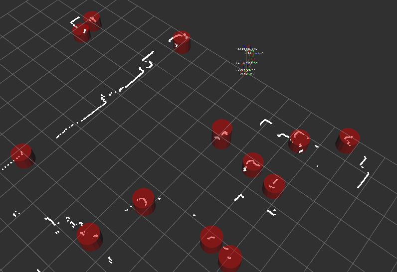

iri_laser_people_detection (ROS package) {#mainpage}
============

# Description

ROS wrapper of the [laser_people_detection](https://gitlab.iri.upc.edu/labrobotica/algorithms/laser_people_detection) C++ driver library.

The node inherits from the [iri_base_algorithm](https://gitlab.iri.upc.edu/labrobotica/ros/iri_core/iri_base_algorithm) class.

# ROS Interface

### Topic subscribers

- *~/scan* ([sensor_msgs/LaserScan](http://docs.ros.org/kinetic/api/sensor_msgs/html/msg/LaserScan.html)): 
  messages coming from an horizontal laser scan sensor

### Topic publishers

- *~/people* ([iri_perception_msgs::detectionArray](https://gitlab.iri.upc.edu/labrobotica/ros/perception/iri_perception_msgs/-/blob/master/msg/detectionArray.msg)):
  people detection messages

- *~/markers* ([visualization_msgs::MarkerArray](http://docs.ros.org/kinetic/api/visualization_msgs/html/msg/MarkerArray.html)):
  visualization markers to be displayed in Rviz

# Dependencies

This node has the following dependencies:

 * ROS
     * tf
     * sensor_msgs
     * visualization_msgs
 * IRI-ROS
     * [iri_base_algorithm](https://gitlab.iri.upc.edu/labrobotica/ros/iri_core/iri_base_algorithm) 
     * [iri_perception_msgs](https://gitlab.iri.upc.edu/labrobotica/ros/perception/iri_perception_msgs)
 * IRI
     * [iriutils](https://gitlab.iri.upc.edu/labrobotica/algorithms/iriutils)
     * [laser_people_detection](https://gitlab.iri.upc.edu/labrobotica/algorithms/laser_people_detection)

# Install

Install its dependencies:
* ROS dependencies can be installed with `sudo apt install ros-$ROS_DISTRO-dependency-name`
* IRI-ROS dependencies normally need to be cloned and compiled in an active ROS workspace, as explained in their README file.
* IRI dependencies can be installed as debian packages, or cloned, compiled and installed from sources. See their README file for details.

This package can be installed by cloning the repository inside an active ROS workspace:

```
roscd
cd ../src
git clone https://gitlab.iri.upc.edu/labrobotica/ros/perception/iri_laser_people_detection.git 
```

However, this package is normally used as part of a wider installation (i.e. a 
robot, an experiment or a demosntration) which will normally include a complete 
rosinstall file to be used with the [wstool](http://wiki.ros.org/wstool) tool.

# How to use it

Example of use playing a rosbag, running the node, showing detections on Rviz and reconfigurable parameters on rqt_reconfigure.

`roslaunch iri_laser_people_detection test.launch`




