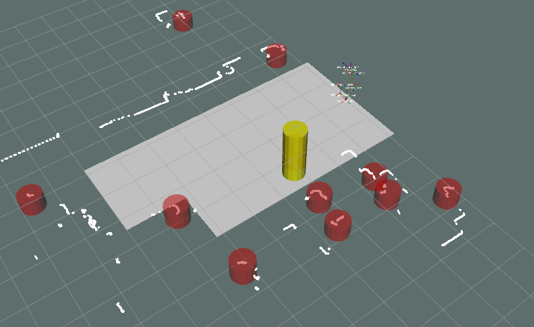

iri_laser_people_map_filter (ROS package) {#mainpage}
============

# Description

Filters out people detections that are close to map obstacles (by neighbor distance threshold). Subscribes to people detection array and map occupancy grid, and publishes filtered people detection array.


# Dependencies

This node has the following dependencies:

 * ROS
     * tf
     * nav_msgs
     * visualization_msgs
 * IRI-ROS
     * [iri_base_algorithm](https://gitlab.iri.upc.edu/labrobotica/ros/iri_core/iri_base_algorithm) 
     * [iri_perception_msgs](https://gitlab.iri.upc.edu/labrobotica/ros/perception/iri_perception_msgs)
     * [iri_laser_people_detection](https://gitlab.iri.upc.edu/labrobotica/ros/perception/iri_laser_people_detection)

# Install

Install its dependencies:
* ROS dependencies can be installed with `sudo apt install ros-$ROS_DISTRO-dependency-name`
* IRI-ROS dependencies normally need to be cloned and compiled in an active ROS workspace, as explained in their README file.

This package, as well as all IRI dependencies, can be installed by cloning the 
repository inside the active workspace:

```
roscd
cd ../src
git clone https://gitlab.iri.upc.edu/labrobotica/ros/perception/iri_laser_people_map_filter.git 
```

However, this package is normally used as part of a wider installation (i.e. a 
robot, an experiment or a demosntration) which will normally include a complete 
rosinstall file to be used with the [wstool](http://wiki.ros.org/wstool) tool.

# How to use it

Example of use playing a rosbag, running the node, along with other nodes (laser_people_detection, map_server, static_transform_publisher) and showing map filtered detections on Rviz and reconfigurable parameters on rqt_reconfigure.

`roslaunch iri_laser_people_map_filter test.launch`




